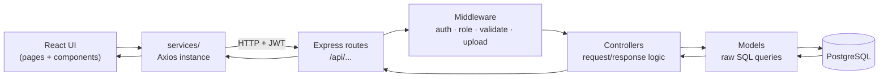
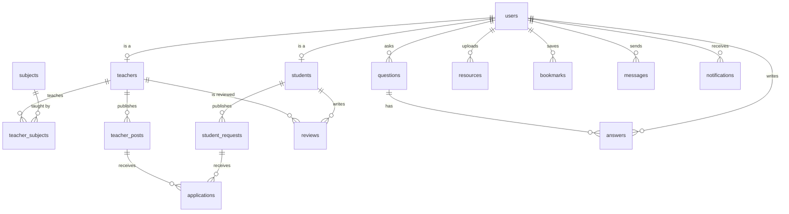

# Tuition Media

> A tutoring marketplace that connects students with teachers — post tuitions, apply, review, ask questions, share resources, and chat, all in one place.

**Tuition Media** is a full-stack web application built with the **PERN** stack (PostgreSQL, Express.js, React.js, Node.js). Teachers advertise what they teach, students post what they need, and the two sides find each other through applications, reviews, a public Q&A board, and direct messaging.


---

## Table of Contents

1. [Features](#features)
2. [Tech Stack](#tech-stack)
3. [Architecture at a Glance](#architecture-at-a-glance)
4. [Project Structure](#project-structure)
5. [Getting Started](#getting-started)
6. [Environment Variables](#environment-variables)
7. [Database Setup](#database-setup)
8. [Running the App](#running-the-app)
9. [API Overview](#api-overview)
10. [Database Schema](#database-schema)
11. [Available Scripts](#available-scripts)
12. [Roadmap](#roadmap)
13. [Contributing](#contributing)
14. [License](#license)

---

## Features

| Area | What it does |
|---|---|
| **Authentication** | Register and log in with email + password. Passwords hashed with bcrypt, sessions handled with JWT. |
| **Roles** | A single `users` table with `student` and `teacher` roles; role-based middleware guards the routes each side is allowed to touch. |
| **Teacher profiles** | Teachers build a profile and attach the subjects they teach (many-to-many through `teacher_subjects`). |
| **Teacher posts** | Teachers publish tuition offers — subject, class level, location, salary, availability. |
| **Student requests** | Students publish what they are looking for so teachers can come to them. |
| **Applications** | Either side can apply to the other's post/request; the owner accepts or rejects. |
| **Reviews & ratings** | Students leave ratings and written reviews on teachers after a tuition. |
| **Q&A board** | Anyone can post an academic question; others answer. Threaded question → answers. |
| **Resources** | Upload and download study materials (PDFs, notes) via Multer file uploads. |
| **Bookmarks** | Save interesting posts, requests, or resources for later. |
| **Messaging** | One-to-one messages between a student and a teacher. |
| **Notifications** | In-app alerts for new applications, replies, messages, and status changes. |

---

## Tech Stack

| Layer | Technology | Notes |
|---|---|---|
| Frontend | **React.js**, React Router, Axios | Pages + reusable components, Context API for global state |
| Backend | **Node.js**, **Express.js** | REST API, MVC-inspired layering |
| Database | **PostgreSQL** | Accessed with the raw `pg` driver — **no ORM**, all SQL is hand-written |
| Auth | **JWT** + **bcrypt** | Stateless tokens, hashed passwords |
| Uploads | **Multer** | Local disk in development, swappable for S3/Cloudinary later |
| Validation | **express-validator** | Rules kept in `validators/`, applied by `validate.middleware.js` |

> **Why no ORM?** Writing the SQL by hand keeps everything visible — you always know exactly which query hits the database and why.

---

## Architecture at a Glance

Every request travels the same path, which makes bugs easy to trace:



**The rule of thumb:**

- `routes/` decide **which URL** exists.
- `controllers/` decide **what happens** when it is hit.
- `models/` are the **only** files that talk to PostgreSQL.

If teacher posts are saving incorrectly, the bug is in `teacherPosts.model.js` or `teacherPosts.controller.js` — nowhere else.

---

## Project Structure

```
tuition-media/
├── backend/
│   ├── src/
│   │   ├── config/          # db.js (pg Pool), env.js (validated env vars)
│   │   ├── routes/          # one file per resource + index.js
│   │   ├── controllers/     # request handling, one per resource
│   │   ├── models/          # raw SQL queries, one per table
│   │   ├── middleware/      # auth, role, error, upload, validate
│   │   ├── utils/           # hashPassword, generateToken, apiResponse, apiError, asyncHandler
│   │   ├── validators/      # express-validator rule sets
│   │   ├── uploads/         # profile-pictures/, resources/, documents/
│   │   ├── app.js           # builds the Express app (no listening)
│   │   └── server.js        # starts the server
│   ├── .env.example
│   └── package.json
│
├── frontend/
│   ├── public/              # index.html, favicon
│   ├── src/
│   │   ├── assets/          # images, icons, global styles
│   │   ├── components/      # common/, teacher/, student/, reviews/, qa/, messaging/
│   │   ├── pages/           # one file per screen
│   │   ├── routes/          # AppRoutes.jsx — the whole site map
│   │   ├── services/        # api.js + one service per backend resource
│   │   ├── context/         # AuthContext, NotificationContext
│   │   ├── hooks/           # useAuth, useFetch, useForm
│   │   ├── utils/           # validators, formatDate, constants
│   │   ├── App.jsx
│   │   └── index.js
│   ├── .env.example
│   └── package.json
│
├── database/
│   ├── schema.sql           # all 15 CREATE TABLE statements, in dependency order
│   ├── seed.sql             # sample data for local testing
│   ├── migrations/          # 001_create_users.sql … 015_create_notifications.sql
│   └── ER-diagram.png
│
├── docs/
│   ├── API.md               # endpoint contract
│   ├── DATABASE.md          # tables and relationships in plain English
│   ├── SETUP.md             # local setup walkthrough
│   └── ARCHITECTURE.md      # why the project is organized this way
│
├── .gitignore
└── README.md
```

`app.js` and `server.js` are deliberately split so tests can import the app (with Supertest) without opening a real port.

---

## Getting Started

### Prerequisites

Install these before you start:

| Tool | Version | Check with |
|---|---|---|
| Node.js | 18 or newer | `node -v` |
| npm | 9 or newer | `npm -v` |
| PostgreSQL | 14 or newer | `psql --version` |
| Git | any recent | `git --version` |

### 1. Clone the repository

```bash
git clone https://github.com/<your-username>/tuition-media.git
cd tuition-media
```

### 2. Install backend dependencies

```bash
cd backend
npm install
```

### 3. Install frontend dependencies

```bash
cd ../frontend
npm install
```

### 4. Create your environment files

```bash
# from the project root
cp backend/.env.example backend/.env
cp frontend/.env.example frontend/.env
```

Then open both `.env` files and fill in the real values — see the next section.

---

## Environment Variables

### `backend/.env`

```env
# Server
PORT=5000
NODE_ENV=development

# PostgreSQL
DB_HOST=localhost
DB_PORT=5432
DB_NAME=tuition_media
DB_USER=postgres
DB_PASSWORD=your_password_here

# Authentication
JWT_SECRET=replace_with_a_long_random_string
JWT_EXPIRES_IN=7d

# CORS — where the React app runs
CLIENT_URL=http://localhost:3000

# Uploads
UPLOAD_DIR=src/uploads
MAX_FILE_SIZE=5242880          # 5 MB, in bytes
```

### `frontend/.env`

```env
REACT_APP_API_BASE_URL=http://localhost:5000/api
```

> Using **Vite** instead of Create React App? Rename the variable to `VITE_API_BASE_URL` and read it with `import.meta.env.VITE_API_BASE_URL`.

**Never commit `.env` files.** Only `.env.example` (with placeholder values) belongs in Git.

---

## Database Setup

### 1. Create the database

```bash
psql -U postgres -c "CREATE DATABASE tuition_media;"
```

### 2. Create the tables

Either run the full schema in one shot:

```bash
psql -U postgres -d tuition_media -f database/schema.sql
```

…or apply the migrations one by one, in numeric order (this is the recommended habit — each file is one tracked change):

```bash
for file in database/migrations/*.sql; do
  echo "Applying $file"
  psql -U postgres -d tuition_media -f "$file"
done
```

On Windows PowerShell:

```powershell
Get-ChildItem database\migrations\*.sql | Sort-Object Name | ForEach-Object {
  psql -U postgres -d tuition_media -f $_.FullName
}
```

### 3. Load sample data (optional)

```bash
psql -U postgres -d tuition_media -f database/seed.sql
```

### 4. Verify

```bash
psql -U postgres -d tuition_media -c "\dt"
```

You should see all 15 tables listed.

---

## Running the App

Open **two terminals**.

**Terminal 1 — backend:**

```bash
cd backend
npm run dev          # nodemon, restarts on save
```

API runs at `http://localhost:5000`.

**Terminal 2 — frontend:**

```bash
cd frontend
npm start
```

App runs at `http://localhost:3000`.

<details>
<summary><b>Optional: run both with one command</b></summary>

Add a root `package.json`:

```json
{
  "name": "tuition-media",
  "private": true,
  "scripts": {
    "install:all": "cd backend && npm install && cd ../frontend && npm install",
    "dev": "concurrently \"npm run dev --prefix backend\" \"npm start --prefix frontend\""
  },
  "devDependencies": {
    "concurrently": "^8.2.2"
  }
}
```

Then `npm install` at the root and run `npm run dev`.
</details>

---

## API Overview

All endpoints are mounted under `/api`. Every route file follows the same REST shape, so learning one teaches you all of them:

```
GET    /api/teacher-posts        # list
GET    /api/teacher-posts/:id    # single
POST   /api/teacher-posts        # create   (auth required)
PUT    /api/teacher-posts/:id    # update   (auth + ownership)
DELETE /api/teacher-posts/:id    # delete   (auth + ownership)
```

| Base path | Purpose | Auth |
|---|---|---|
| `/api/auth` | Register, login, current user | Public / token |
| `/api/users` | Account data, profile picture | Token |
| `/api/students` | Student profiles | Token |
| `/api/teachers` | Teacher profiles, search & filter | Public read |
| `/api/subjects` | Subject catalogue | Public read |
| `/api/teacher-subjects` | Link teachers to subjects | Teacher |
| `/api/teacher-posts` | Tuition offers from teachers | Teacher writes |
| `/api/student-requests` | Tuition requests from students | Student writes |
| `/api/applications` | Apply, accept, reject | Token |
| `/api/reviews` | Ratings and written reviews | Student writes |
| `/api/questions` | Q&A board questions | Token |
| `/api/answers` | Answers to questions | Token |
| `/api/resources` | Upload/download study materials | Token |
| `/api/bookmarks` | Personal saved items | Token |
| `/api/messages` | One-to-one conversations | Token |
| `/api/notifications` | Read/unread alerts | Token |

Protected routes expect the token in the header:

```
Authorization: Bearer <your_jwt_token>
```

Every response uses one consistent shape (built by `utils/apiResponse.js` and `utils/apiError.js`):

```json
{
  "success": true,
  "message": "Teacher post created successfully",
  "data": { }
}
```

📄 Full request/response details live in [`docs/API.md`](docs/API.md).

---

## Database Schema

15 tables, one model file each:

| # | Table | Holds |
|---|---|---|
| 1 | `users` | Shared account data: email, password hash, role |
| 2 | `students` | Student-specific profile fields |
| 3 | `teachers` | Teacher-specific profile fields, qualifications |
| 4 | `subjects` | Master list of subjects |
| 5 | `teacher_subjects` | Join table: which teacher teaches which subject |
| 6 | `teacher_posts` | Tuition offers published by teachers |
| 7 | `student_requests` | Tuition requests published by students |
| 8 | `applications` | Applications made to posts/requests |
| 9 | `reviews` | Ratings and comments on teachers |
| 10 | `questions` | Q&A board questions |
| 11 | `answers` | Replies to questions |
| 12 | `resources` | Uploaded study material metadata |
| 13 | `bookmarks` | Saved items per user |
| 14 | `messages` | Direct messages between users |
| 15 | `notifications` | Per-user alerts |

Simplified relationship map:



The authoritative diagram is [`database/ER-diagram.png`](database/ER-diagram.png); column-level details are in [`docs/DATABASE.md`](docs/DATABASE.md).

---

## Available Scripts

**Backend** (`cd backend`)

| Command | Does |
|---|---|
| `npm run dev` | Start with nodemon (auto-restart on save) |
| `npm start` | Start normally (production) |
| `npm test` | Run tests, once `backend/tests/` exists |

**Frontend** (`cd frontend`)

| Command | Does |
|---|---|
| `npm start` | Start the dev server on port 3000 |
| `npm run build` | Production build into `build/` |
| `npm test` | Run React tests |

---

## Roadmap

- [ ] `backend/tests/` — Jest + Supertest coverage for controllers and models
- [ ] Real-time messaging and notifications with Socket.IO (`backend/src/sockets/`)
- [ ] Cloud file storage (S3 or Cloudinary) replacing local `uploads/`
- [ ] Search and filtering: by subject, location, salary range, rating
- [ ] Pagination on all list endpoints
- [ ] Email verification and password reset
- [ ] Admin panel for moderating posts, reviews, and users
- [ ] `.github/workflows/` — CI to lint and test on every push
- [ ] `docker-compose.yml` — PostgreSQL + backend + frontend in one command
- [ ] Deployment: backend on Render/Railway, frontend on Vercel/Netlify

---

## Contributing

1. Fork the repository and create a branch: `git checkout -b feature/your-feature`
2. Follow the existing pattern — a new resource means **one** route file, **one** controller, **one** model, **one** migration, and (if the UI needs it) **one** service file.
3. Commit with a clear message: `git commit -m "Add bookmark filtering by type"`
4. Push and open a pull request describing what changed and why.

---

## License

Released under the MIT License. See [`LICENSE`](LICENSE) for details.

---

## Author

**\<Your Name\>** — [GitHub](https://github.com/<your-username>) · [Email](mailto:you@example.com)

If this project helped you, a ⭐ on the repository is always appreciated.